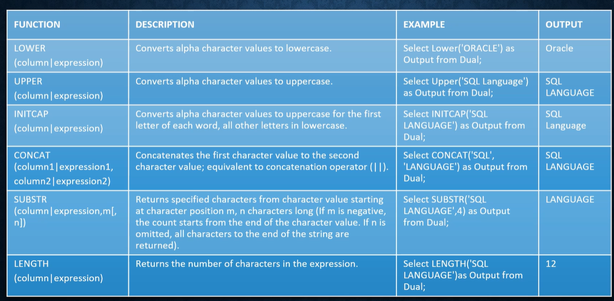
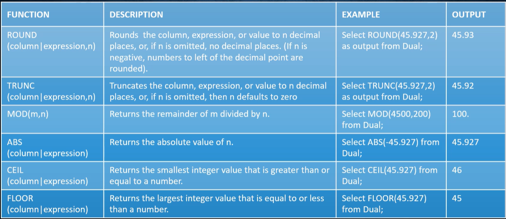
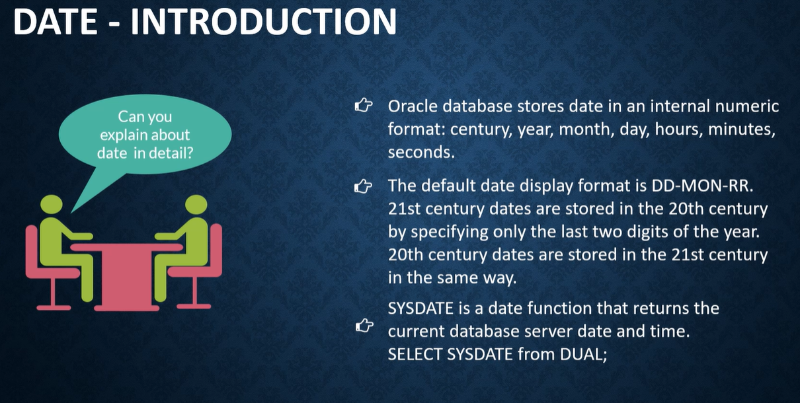

# Single Row Functions

# Functions

* A function is a block of code that sometimes take arguments and always returns the value.

* used to
    - Perform calculations on data.
    - modify individual data items
    - manipulate from group of rows
    - Format dates and numbers for display
    - convert column data types

# Function Types
1. Single row/ Scalar Functions 
2. Multi row or aggregate Functions

## 1.Single Row Function

* manipulates data items.
* accepts arguments and returns one value.
* acts on each row returned.
* returns one result per row.
* may modify the data type.
* can be nested.
* accepts arguments which can be column or an expression.
* function_name([arg1, arg2,...])

### Character Functions

### Numeric Functions

### Date Introduction

> Default returns NULL

> Arithmetic expressions or single row function containing a null value evaluate to null.
