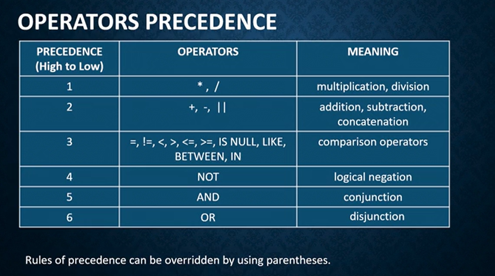

# SELECT

* used to retrieve data from one or more rows tables or views.

* the result is stored in temporary result table, called result-set.

> data stored in SQL table is case sensitive.

**Syntax**
```
SELECT [DISTINCT] [column_name1, column_name2, ...] | * FROM table_name [alias] [, table_name [alias]] [WHERE conditions] [GROUP BY column1 [, column2,...] [HAVING group_conditions]] [ORDER BY sort_columns [ASC|DESC]];
```

```
SELECT 20*55 FROM DUAL;
SELECT 20*55 RESULT FROM DUAL;

SELECT * FROM DEPARTMENTS;
SELECT DepartmentNo, Name from Department;

SELECT EmployeeNo, Name, DeptNo, FROM Employee WHERE Salary > 5000;

```
**Relational Operators in SQL**

= , > , >=, <, <=, !=


> Character strings and dates in the WHERE clause must be enclosed in single quotation marks ('');


**Other Comparision Operators**

* Between X and Y - [X, Y]

* IN () - match any of the list values
    - WHERE Salary IN (5000, 6000, 7000)

* IS NULL 

> NULL is not same as zero or a space. Zero is a number, and space is a character. If any operation has NULL value, then the operation is NULL.

* LIKE  - Match a character pattern 
    - WHERE Email LIKE '%.com'
    - LIKE operator is used to perform wildcard searches of string values.
    - % denotes zero or more characters.
    - _ denotes one character.


**Logical Operators**

AND, OR, NOT

**Operators Precedence**



**Contatenation Operator**

* represented by two vertical bars ||.
* Contatentates columns or Character strings to other columns.

* Creating resultant column that is character expression.


```
SELECT Name || 'contact@' || Mail AS "Employee Contact" FROM Employee WHERE email IS NOT NULL;
```

> For aliases enclose it in double quotes.


**Eliminating Duplicate rows**

* use DISTINCT 

```
SELECT DISTINCT DeptNo FROM Employee; 
```


**ORDER BY clause**

ASC and DES

* comes last in SELECT clause
